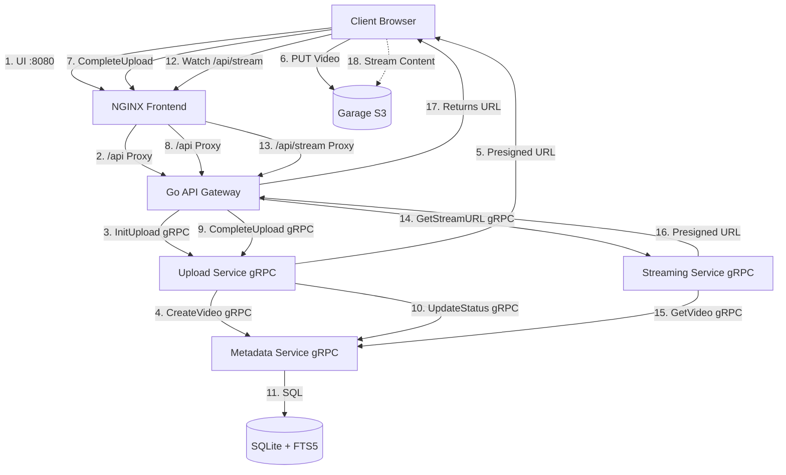

# GoTube - Microservices Video Platform

A scalable YouTube-like video platform built with Go microservices, gRPC, Docker, SQLite (with FTS5), and Garage (S3-compatible).

## 🚀 Features

-   **Microservices Architecture**: Independently deployable services for Upload, Streaming, and Metadata.
-   **API Gateway**: Centralized Go-based Gateway handling HTTP requests and routing to gRPC backend services.
-   **gRPC Communication**: High-performance inter-service communication.
-   **Direct S3 Uploads**: Utilizes Presigned URLs for high-performance uploads.
-   **Full-Text Search**: SQLite FTS5 integration for fast video searching.
-   **Persistence**: SQLite for metadata, Garage for distributed object storage.
-   **Docker Orchestration**: Simple `make up` command setup.

## 🏗 Architecture



## 🛠 Tech Stack

-   **Backend**: Go (Golang) 1.25, gRPC, Protobuf
-   **Frontend**: HTML5, Vanilla JS, Nginx
-   **Database**: SQLite with FTS5 (Full-Text Search)
-   **Storage**: Garage (S3 Compatible Distributed Storage)
-   **Infrastructure**: Docker Compose, Makefile

## 🏃‍♂️ Runbook / Getting Started

### Prerequisites

-   Docker & Docker Compose installed.
-   `make` (optional, for convenience).

### 1. Start the System

Run the following command in the project root:

```bash
make up
```

This will:
1.  Start Garage (S3) and configure buckets/keys.
2.  Start Gateway, Metadata, Upload, Streaming, and Web services.
3.  Initialize the SQLite database with FTS schema.

### 2. Access the Application

-   **Frontend**: [http://localhost:8080](http://localhost:8080)
-   **Garage Web UI**: [http://localhost:3909](http://localhost:3909)

### 3. Usage Guide

#### Uploading a Video
1.  Go to [http://localhost:8080/upload.html](http://localhost:8080/upload.html).
2.  Enter a title and select a video file.
3.  Click **Upload**.

#### Watching a Video
1.  Go to [http://localhost:8080](http://localhost:8080).
2.  Use the search bar to find videos (FTS enabled).
3.  Click on any video in the list.

## 🔌 API Documentation (Gateway)

Base URL: `http://localhost:8080/api`

-   `POST /upload/init`: Initialize upload (JSON: `filename`, `title`).
-   `POST /upload/complete`: Complete upload (JSON: `video_id`).
-   `GET /videos?q=...`: Search videos.
-   `GET /stream/videos/{id}`: Get streaming URL (returns JSON:API with presigned URL).
